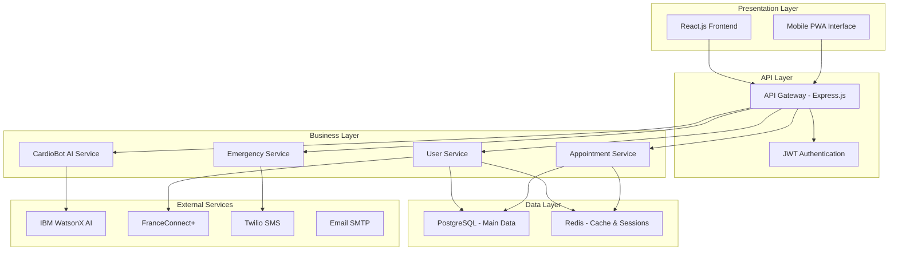
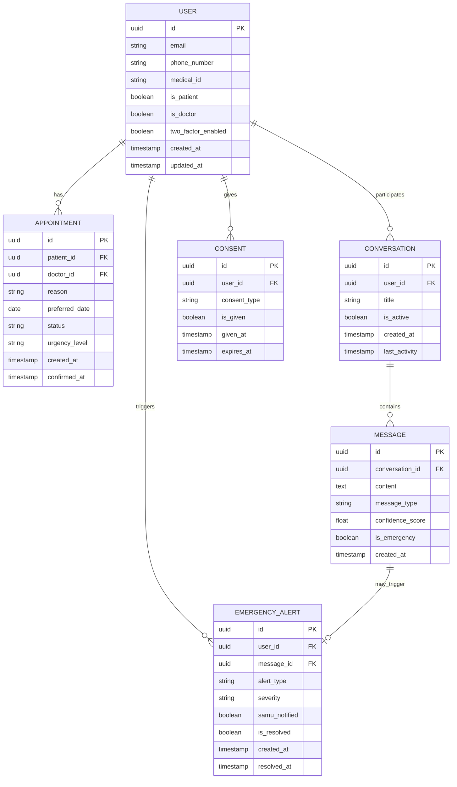
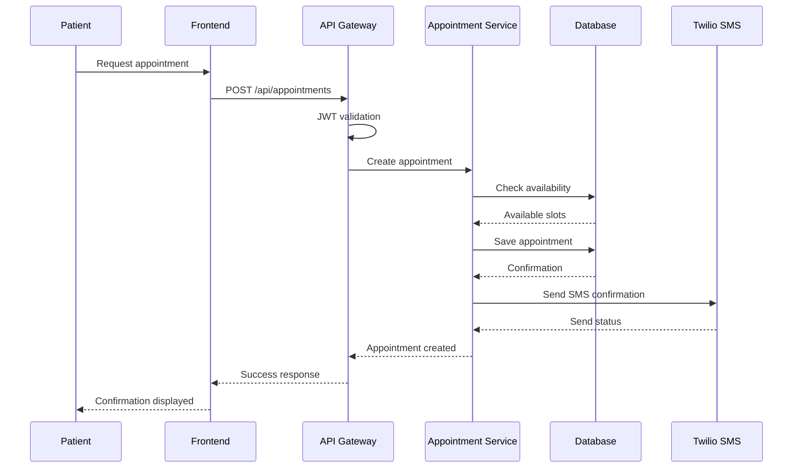
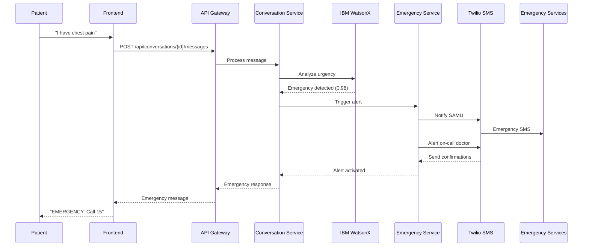
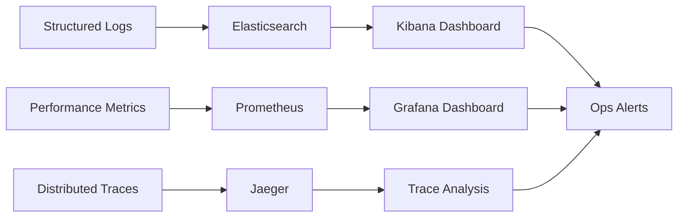

# 📋 CardioBot MVP Technical Documentation

---

## 📑 Table of Contents

1. [User Stories and Mockups](#1-user-stories-and-mockups)
2. [System Architecture](#2-system-architecture)
3. [Components and Database Design](#3-components-and-database-design)
4. [Sequence Diagrams](#4-sequence-diagrams)
5. [API Specifications](#5-api-specifications)
6. [SCM and QA Plans](#6-scm-and-qa-plans)
7. [Technical Justifications](#7-technical-justifications)

---

## 1. User Stories and Mockups

### 📋 Prioritized User Stories (MoSCoW)

#### 🔴 Must Have - Critical Features

**🔐 Authentication and Security**
| 👤 As a | 💭 I want | 🎯 So that |
|-------------|---------|----------|
| Patient | to authenticate via FranceConnect+ | I can securely access my personal space |
| Practitioner | to have two-factor authentication | I can protect access to sensitive patient data |

**📅 Appointment Management**
| 👤 As a | 💭 I want | 🎯 So that |
|-------------|---------|----------|
| Patient | to book appointments online | I can avoid phone calls |
| Patient | to receive automatic confirmations and reminders | I don't forget my appointments |
| Practitioner | to view my daily schedule | I can optimize my time management |

**🤖 Virtual Assistant**
| 👤 As a | 💭 I want | 🎯 So that |
|-------------|---------|----------|
| Patient | to ask administrative questions to the chatbot | I can get quick responses |
| Medical secretary | the chatbot to automatically sort requests | I can prioritize emergencies |

#### 🟡 Should Have - Important Features

**📊 Medical Monitoring**
| 👤 As a | 💭 I want | 🎯 So that |
|-------------|---------|----------|
| Patient | to consult my medical history | I can track my health evolution |
| Practitioner | to access patient histories | I can propose adapted treatments |

#### 🟢 Could Have - Desirable Features

**📱 Advanced Notifications**
| 👤 As a | 💭 I want | 🎯 So that |
|-------------|---------|----------|
| Patient | to receive medication reminders | I can improve treatment compliance |
| Practitioner | to be alerted of detected emergencies | I can intervene quickly |

### 🎨 Main Mockups

#### Patient Interface - Dashboard
```
+--------------------------------------------------+
| CardioBot           Menu ☰             Profile ▾ |
+--------------------------------------------------+
|                                                  |
| Next Appointment                                 |
| +--------------------------------------------+  |
| | Dr. Martin - Cardiologist                  |  |
| | June 15, 2025 - 2:30 PM                   |  |
| +--------------------------------------------+  |
|                                                  |
| Messages (3)                                     |
| +--------------------------------------------+  |
| | - Results available                        |  |
| | - Appointment reminder                     |  |
| +--------------------------------------------+  |
|                                                  |
| Virtual Assistant                               |
| +--------------------------------------------+  |
| | How can I help you today?                  |  |
| +--------------------------------------------+  |
+--------------------------------------------------+
```

#### Practitioner Interface - Schedule
```
+--------------------------------------------------+
| Schedule - May 27, 2025                          |
+--------------------------------------------------+
| 09:00 - Mr. Dupont                              |
|        Follow-up consultation                    |
| ------------------------------------------------|
| 10:30 - Mrs. Bernard                            |
|        First consultation                        |
| ------------------------------------------------|
| 02:00 PM - Mr. Martin                           |
|        Exam results                             |
+--------------------------------------------------+
|        [ + New Appointment ]                     |
+--------------------------------------------------+
```

---

## 2. System Architecture

### 🏗️ High-Level Architecture Diagram



### 🎯 Main Components

| Component | Technology | Responsibility |
|-----------|-------------|----------------|
| **Frontend** | React.js + TypeScript | Responsive user interface |
| **API Gateway** | Node.js + Express.js | Routing and authentication |
| **Database** | PostgreSQL | Data persistence |
| **Cache** | Redis | Sessions and temporary data |
| **AI** | IBM WatsonX | Intelligent medical assistant |
| **Authentication** | FranceConnect+ | Security and identification |

---

## 3. Components and Database Design

### 🗄️ Entity-Relationship Diagram



### 🏛️ DDD Structure (Domain Driven Design)

```
CardioBot/
├── domain/
│   ├── authentication/
│   │   ├── models/          # User, Consent entities
│   │   ├── application/     # Business services
│   │   ├── infrastructure/  # Repositories
│   │   └── interfaces/      # REST API
│   ├── appointments/
│   │   ├── models/          # Appointment entity
│   │   ├── application/     # Scheduling logic
│   │   └── interfaces/      # API endpoints
│   ├── conversation/
│   │   ├── models/          # Conversation, Message
│   │   ├── application/     # AI and processing
│   │   └── interfaces/      # Chat API
│   └── emergency/
│       ├── models/          # EmergencyAlert
│       ├── application/     # Emergency detection
│       └── interfaces/      # Alerts API
```

---

## 4. Sequence Diagrams

### 🔄 Sequence: Appointment Booking



### 🚨 Sequence: Emergency Detection



---

## 5. API Specifications

### 🌐 External APIs

| API | Purpose | Justification |
|-----|---------|---------------|
| **IBM WatsonX** | Conversational medical AI | Medical expertise, GDPR compliance, French support |
| **FranceConnect+** | Secure authentication | Government standard, healthcare compliance |
| **Twilio SMS** | Emergency notifications | Reliability, HIPAA compliance |
| **SMTP/SendGrid** | Email communications | Delivery tracking, medical templates |

### 🔧 Main Internal API Endpoints

#### Authentication
```http
POST /api/auth/login
Content-Type: application/json

{
  "username": "patient@example.com",
  "password": "securepassword",
  "two_factor_token": "123456"
}

Response:
{
  "success": true,
  "token": "eyJhbGciOiJIUzI1NiIs...",
  "user": {
    "id": "uuid",
    "is_patient": true,
    "two_factor_enabled": false
  },
  "expires_at": "2025-05-28T10:30:00Z"
}
```

#### Conversation
```http
POST /api/conversations/{id}/messages
Authorization: Bearer <token>
Content-Type: application/json

{
  "content": "I have chest pain",
  "message_type": "user"
}

Response:
{
  "success": true,
  "user_message": {
    "id": "uuid",
    "content": "I have chest pain",
    "timestamp": "2025-05-27T14:30:00Z"
  },
  "bot_response": {
    "id": "uuid",
    "content": "EMERGENCY: Call SAMU immediately (15)",
    "confidence_score": 0.98,
    "is_emergency": true
  }
}
```

#### Appointments
```http
POST /api/appointments
Authorization: Bearer <token>
Content-Type: application/json

{
  "reason": "Cardiology consultation",
  "preferred_date": "2025-06-15",
  "urgency_level": "routine"
}

Response:
{
  "success": true,
  "appointment": {
    "id": "uuid",
    "status": "pending",
    "preferred_date": "2025-06-15",
    "created_at": "2025-05-27T14:30:00Z"
  }
}
```

---

## 6. SCM and QA Plans

### 🌿 Source Code Management (SCM) Strategy

#### Git Workflow
```
main
├── develop
│   ├── feature/auth-franceconnect
│   ├── feature/chat-ai-integration
│   ├── feature/appointment-booking
│   └── feature/emergency-detection
├── release/v1.0.0
└── hotfix/security-patch
```

#### Branches and Conventions
| Type | Convention | Example |
|------|------------|---------|
| **Feature** | `feature/description` | `feature/auth-franceconnect` |
| **Bugfix** | `bugfix/issue-number` | `bugfix/auth-123` |
| **Hotfix** | `hotfix/critical-fix` | `hotfix/security-patch` |
| **Release** | `release/version` | `release/v1.0.0` |

#### Conventional Commits
```bash
feat(auth): add FranceConnect+ integration
fix(chat): resolve emergency detection accuracy
docs(api): update authentication endpoints
test(appointment): add booking validation tests
```

### 🧪 Quality Assurance (QA) Plan

#### Test Levels
```mermaid
pyramid
    title Tests Pyramid
    
    subgraph "E2E Tests"
        direction TB
        A[User Interface Tests]
        B[Complete Journey Tests]
    end
    
    subgraph "Integration Tests"
        direction TB
        C[API Tests]
        D[Database Tests]
        E[External Services Tests]
    end
    
    subgraph "Unit Tests"
        direction TB
        F[Business Logic Tests]
        G[Component Tests]
        H[Utility Tests]
    end
```

#### Testing Strategy

**🔬 Unit Tests (70%)**
```javascript
// Example: Appointment validation test
describe('AppointmentService', () => {
  test('should validate appointment date in future', () => {
    const pastDate = '2025-05-01';
    const result = appointmentService.validateDate(pastDate);
    expect(result.isValid).toBe(false);
    expect(result.error).toBe('Date must be in the future');
  });
});
```

**🔗 Integration Tests (20%)**
```javascript
// Example: Appointment API test
describe('POST /api/appointments', () => {
  test('should create appointment with valid data', async () => {
    const response = await request(app)
      .post('/api/appointments')
      .set('Authorization', `Bearer ${validToken}`)
      .send(validAppointmentData);
    
    expect(response.status).toBe(201);
    expect(response.body.success).toBe(true);
  });
});
```

**🌐 E2E Tests (10%)**
```javascript
// Example: Patient journey test
describe('Patient Journey', () => {
  test('should complete appointment booking flow', async () => {
    await page.goto('/login');
    await page.fill('[data-testid="email"]', 'patient@test.com');
    await page.click('[data-testid="login-button"]');
    await page.click('[data-testid="book-appointment"]');
    await expect(page.locator('[data-testid="success-message"]')).toBeVisible();
  });
});
```

#### Quality Metrics
| Metric | Target | Tool |
|----------|----------|-------|
| **Code Coverage** | > 85% | Jest Coverage |
| **Code Quality** | Grade A | SonarQube |
| **Security** | 0 critical vulnerabilities | OWASP ZAP |
| **Performance** | < 2s load time | Lighthouse |

---

## 7. Technical Justifications

### 🎯 Technology Choices

#### Frontend: React.js + TypeScript
**Justification:**
- ✅ **Mature Ecosystem** : Large community, numerous libraries
- ✅ **Performance** : Virtual DOM for automatic optimizations  
- ✅ **TypeScript** : Type safety for critical applications
- ✅ **PWA Support** : Mobile installation without store
- ✅ **Accessibility** : Native ARIA support for RGAA compliance

#### Backend: Node.js + Express.js
**Justification:**
- ✅ **Unified JavaScript** : Same language frontend/backend
- ✅ **Performance** : Async I/O for high concurrent handling
- ✅ **NPM Ecosystem** : Rapid external API integrations
- ✅ **Microservices** : Easily scalable architecture
- ✅ **Native JSON** : Optimized API communication

#### Database: PostgreSQL
**Justification:**
- ✅ **ACID Compliance** : Critical integrity for medical data
- ✅ **Advanced Security** : Encryption, audit trail, row-level security
- ✅ **Performance** : Advanced indexes, optimized complex queries
- ✅ **JSON Support** : Flexibility for semi-structured data
- ✅ **Medical Compliance** : Healthcare certifications available

#### Cache: Redis
**Justification:**
- ✅ **Memory Performance** : < 1ms access for user sessions
- ✅ **Advanced Structures** : Pub/sub support for real-time
- ✅ **Persistence** : Automatic backup critical data
- ✅ **Clustering** : High availability required for medical
- ✅ **Automatic TTL** : Secure session expiry management

#### AI: IBM WatsonX
**Justification:**
- ✅ **Medical Expertise** : Pre-trained healthcare domain models
- ✅ **Compliance** : GDPR, HIPAA, medical certifications
- ✅ **French Medical** : Specialized French terminology support
- ✅ **Enterprise Reliability** : 99.9% SLA, 24/7 support
- ✅ **Integration** : Standardized REST APIs

#### Authentication: FranceConnect+
**Justification:**
- ✅ **Government Standard** : French security reference
- ✅ **Healthcare Integration** : Compatible with Carte Vitale, medical records
- ✅ **Native GDPR** : Privacy-by-design conception
- ✅ **User Simplicity** : Familiar UX for French citizens
- ✅ **Audit Trail** : Traceability for sensitive data access

### 🏗️ Architecture Patterns

#### Domain Driven Design (DDD)
**Justification:**
- ✅ **Business Complexity** : Clear separation of medical logic
- ✅ **Evolutivity** : Add features without regression
- ✅ **Testing** : Domain isolation for targeted tests
- ✅ **Team** : Parallel development by domain
- ✅ **Maintenance** : Self-documented code through structure

#### Microservices Pattern
**Justification:**
- ✅ **Independent Scalability** : AI Chat vs Appointments different loads
- ✅ **Deployment** : Partial updates without downtime
- ✅ **Technology** : Optimal choice per service
- ✅ **Resilience** : Failure isolation, circuit breakers
- ✅ **Team** : Clear ownership per service

### 🔒 Security and Compliance

#### Multi-Level Security Strategy
```
┌─────────────────────────────────────┐
│        Level 1: Network             │
│     HTTPS/TLS 1.3, Firewall        │
├─────────────────────────────────────┤
│      Level 2: Application           │
│   JWT, Rate Limiting, CORS          │
├─────────────────────────────────────┤
│      Level 3: Data                  │
│  AES-256 Encryption, Audit Trail    │
├─────────────────────────────────────┤
│      Level 4: Compliance            │
│     GDPR, ANSSI, ISO 27001          │
└─────────────────────────────────────┘
```

#### Regulatory Compliance
- **🇫🇷 GDPR** : Right to be forgotten, portability, data minimization
- **🏥 HDS** : Healthcare Data Hosting (certification preparation)
- **🔐 ANSSI** : Healthcare information systems security guide
- **📋 ISO 27001** : Information security management
- **⚖️ CNIL** : Healthcare data processing compliance declaration

### 📊 Metrics and Monitoring

#### 360° Observability


#### Critical KPIs
| Metric | Alert Threshold | Business Impact |
|----------|--------------|---------------|
| **AI Response Time** | > 5s | User experience |
| **Emergency Detection** | < 95% accuracy | Patient safety |
| **API Availability** | < 99.5% | Healthcare access |
| **Auth Errors** | > 1% | System security |

---

## 📈 Conclusion

This technical documentation provides a solid foundation for CardioBot MVP development and maintenance. The proposed architecture ensures:

- **🔒 Security** : Multi-level with regulatory compliance
- **⚡ Performance** : Technologies optimized for medical workload
- **🔧 Maintainability** : Clear and testable DDD structure
- **📈 Scalability** : Microservices for future growth
- **🏥 Reliability** : Proven patterns for critical domain

The technical roadmap enables progressive implementation with continuous validation of business and regulatory requirements for the French medical sector.
